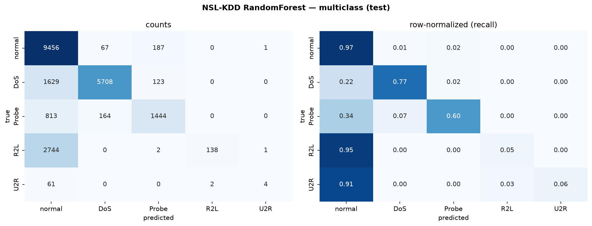
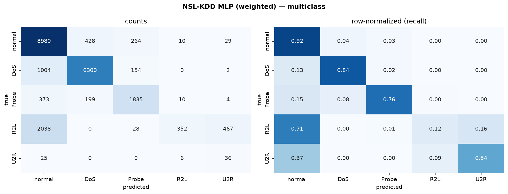

# Network Intrusion Detection — an ML study (NSL-KDD → NetFlow-V2)

An end-to-end, test-driven machine-learning study of **network intrusion
detection**, framed from a SOC (Security Operations Centre) analyst's
perspective. **`v1.0` delivers the complete NSL-KDD pipeline**; the project then
extends to modern, standardized **NetFlow-V2** datasets for a cross-dataset
generalization study.

> Built as an MSc-AI portfolio piece. Every modelling decision is documented and
> interview-defensible; plain-language learning notes are in [`docs/learning/`](docs/learning/).

---

## Why ML for intrusion detection (the SOC view)

Signature/rule-based detection (the bread and butter of tools like Splunk,
CrowdStrike, SentinelOne) is precise but brittle: it only catches what someone
already wrote a rule for, and attackers mutate constantly. Supervised ML learns
the *statistical shape* of attacks from labelled traffic, offering first-pass
triage that can generalize beyond exact signatures. The interesting question
isn't "can it hit high accuracy" — it's **where it fails, and whether it
degrades gracefully as attacks evolve**. That failure analysis is the core of
this project.

## Headline results (NSL-KDD, official KDDTest+)

| Model | Binary macro-F1 | 5-class macro-F1 | R2L recall | U2R recall |
|---|---:|---:|---:|---:|
| Random Forest | 0.776 | 0.504 | 0.05 | 0.06 |
| LightGBM | 0.785 | 0.281 | 0.001 | 0.00 |
| MLP (unweighted) | **0.810** | **0.563** | 0.013 | 0.269 |
| MLP (class-weighted) | 0.798 | 0.561 | **0.122** | **0.537** |

**Three findings that matter more than the numbers:**

1. **The generalization gap is real and deliberate.** Models scored **~0.99
   macro-F1 in cross-validation** but **~0.78 on the official test set** — because
   the test set contains **17 attack types never seen in training**. A random
   split would hide this; the official split honestly measures how detection
   copes with *novel* attacks. This is the "detection goes stale" problem in one
   number.
2. **Rare = dangerous = missed.** With default tree training, the two most dangerous
   attack families — R2L (remote access) and U2R (privilege escalation) — are
   caught **5–6% of the time**, with ~90% predicted as benign. Accuracy (0.74)
   hides this; **macro-F1 (0.50) exposes it.**
3. **Class weighting changes the trade-off, not magically fixes the benchmark.**
   On the latest stable CPU run, weighting the MLP loss lifted **R2L recall from
   0.013→0.122** and **U2R recall from 0.269→0.537**, while macro-F1 stayed about
   flat (0.563→0.561). For a SOC, that is still an important knob: you may accept
   different false alarms if the alternative is missing privilege-escalation
   attacks.

<p align="center">
  <br>
  <em>Baseline RF: R2L/U2R collapse into "normal" (recall 0.05 / 0.06).</em><br><br>
  <br>
  <em>Class-weighted MLP: rare-class recall improves, especially U2R, but the result still needs multi-seed confirmation.</em>
</p>

## Datasets

| Dataset | Era | Role | Split | Status |
|---|---|---|---|---|
| **NSL-KDD** | 1999 | historical baseline | official (+ hard `KDDTest-21`) | ✅ `v1.0` |
| **NF-UNSW-NB15-v2** | 2015 | modern (imbalance study) | official | ▶ upcoming |
| **NF-ToN-IoT-v2** | 2020 | modern IoT (explainability) | official | ▶ upcoming |
| **NF-CSE-CIC-IDS2018-v2** | 2018 | modern at scale | constructed | ▶ upcoming |

The modern datasets are the **NetFlow-V2 standardized family** (Sarhan et al.,
2021), which re-express multiple captures into **one shared 43-feature NetFlow
schema** — enabling *true cross-dataset transfer* (train on one, test on another),
the cleanest form of the staleness experiment.

> **Migration note.** Earlier iterations used the raw UNSW-NB15 and CICIDS2017
> CSVs. These are **retired** in favour of their NetFlow-V2 versions (shared
> schema, cleaner labels, comparable methodology). Their download provenance is
> preserved in `data/unsw_nb15/SOURCE.md` and `data/cicids2017/SOURCE.md`.

Data is downloaded + integrity-verified programmatically (row/column counts +
SHA-256); see `src/download_data.py` and `data/*/SOURCE.md`. Bulk data is
gitignored.

## Approach

1. **EDA** ([`notebooks/01_eda.ipynb`](notebooks/01_eda.ipynb)) — class balance,
   the train→test shift, feature separation, correlations.
2. **Preprocessing** (`src/preprocess.py`) — a leakage-safe
   `ColumnTransformer`: one-hot (`handle_unknown='ignore'`) for categoricals,
   `StandardScaler` for numerics, **fit on train only**. Binary + 5-class labels.
3. **Tree baselines** (`src/train_baselines.py`) — Random Forest + **LightGBM**,
   light CV tuning (train-only), full evaluation.
4. **MLP** (`src/train_mlp.py`) — PyTorch net (128-64, dropout, early stopping,
   CPU/Apple-MPS), with the **class-weighting ablation**.
5. **Evaluation** (`src/evaluate.py`) — one model-agnostic module: macro-F1 +
   per-class recall (never accuracy alone), confusion matrices (raw +
   row-normalized), ROC-AUC + PR-AUC for binary.

**Why the official split, not a random one:** the official `KDDTest+` withholds
attack types from training, simulating real-world novelty. A random re-split
would make train and test identically distributed and inflate every score.

## Reproduce

```bash
# 1. environment (Python 3.14)
python3 -m venv .venv && source .venv/bin/activate
pip install -r requirements.txt
# macOS only (LightGBM/XGBoost OpenMP runtime):
brew install libomp

# 2. data (NSL-KDD; ~22 MB, verified on download)
python src/download_data.py nsl_kdd

# 3. run the pipeline
python src/train_baselines.py     # Phase 3 — RF + LightGBM  (~90s)
python src/train_mlp.py           # Phase 4 — MLP ablation    (~70s)

# 4. tests (28, TDD)
pytest
```

Outputs land in `results/metrics.md` and `results/figures/`. Everything is
deterministic under `RANDOM_STATE = 42`. On macOS, `src/train_baselines.py`
also pins native OpenMP thread counts to avoid LightGBM/libomp crashes from
nested parallelism.

## Limitations (read these)

- **NSL-KDD is old and synthetic** (derived from 1998 simulated traffic).
  Absolute scores here do **not** transfer to modern networks — the value is the
  *methodology* and *relative* model comparison. (The NetFlow-V2 phase addresses
  modernity directly.)
- **Some classes may be unlearnable.** 52 U2R training examples is likely too few
  for reliable detection; near-zero baseline recall there is an honest finding.
- **Single fixed test split** — one draw, so headline numbers carry variance
  (mitigated by CV *during tuning*).
- **Cross-*dataset* transfer isn't possible with heterogeneous feature spaces** —
  which is exactly why the project moves to the shared-schema NetFlow-V2 data.

## Next steps

- Download + integrate the **NetFlow-V2 trio**; run each with a *distinct* tactic
  (imbalance arsenal / SHAP explainability / big-data scaling).
- **Cross-dataset transfer** experiment on the shared 43-feature schema — the
  headline "detection goes stale" result.
- Class-imbalance techniques beyond weighting (SMOTE, cost-sensitive), threshold
  tuning, and probability calibration.

## Project structure

```
src/            download_data.py · data.py · preprocess.py · evaluate.py
                train_baselines.py · train_mlp.py
tests/          28 pytest tests (schema, leakage, metrics, MLP)
notebooks/      01_eda.ipynb
results/        metrics.md · figures/
docs/           PROGRESS.md · learning/00-03 (plain-language explainers)
.claude/skills/ nids-conventions  (project conventions)
```

## Attribution

Datasets © their respective authors — cite **Tavallaee et al.**, *A Detailed
Analysis of the KDD CUP 99 Data Set* (IEEE CISDA 2009) for NSL-KDD, and
**Sarhan et al.**, *Towards a Standard Feature Set for NIDS Datasets* (2021) for
NetFlow-V2. Code under the MIT License (see [`LICENSE`](LICENSE)).
